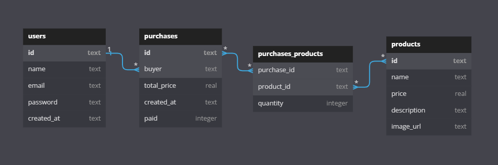

# Projeto Backend - Labecommerce

## 📝 Descrição

API de gestão de clientes (users), produtos (products) e compras (purchases) realizadas no Labecommerce. É uma aplicação back-end de servidor express com banco de dados SQLite3. 

### BANCO DE DADOS

## 📜 Documentação

https://documenter.getpostman.com/view/24460805/2s935iumZJ

## 🕹 Endpoints

USERS
- GET All Users; 
- GET Users by Name; 
- POST Create User; 
- PUT Edit User; 
- DEL Delete User; 

PRODUCTS
- GET All Products;
- GET Product by Id;
- POST Create Product;
- PUT Edit Product;
- DEL Delete Product;

PURCHASES
- GET All Purchases;
- GET Purchase by Id;
- POST Create Purchase;
- DEL Delete Purchase;

## 🛠 Tecnologias Utilizadas

- NodeJS
- Typescript
- Express
- SQL e SQLite
- Knex
- Postman

## 👩‍💻 Pessoa autora

Laís Rodrigues Macedo  
📧 laisrodriguesmacedo@gmail.com  
📞 (+49) 174 7781517
